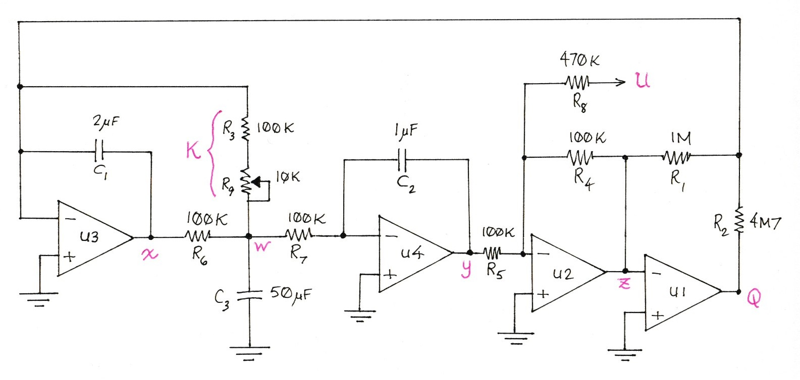

# Sloth Torpor simulation

This is a software emulation of the Torpor variant of the Eurorack module
[Sloth Chaos](https://www.nonlinearcircuits.com/modules/p/4hp-sloth-chaos)
by Andrew Fitch at
[Nonlinear Circuits](https://www.nonlinearcircuits.com/).
Sloth Torpor is a chaotic oscillator that emits two slowly
changing voltages designated $x$ and $y$.

The behavior of this circuit is unpredictable over time,
but more orderly than random. It is often used as a low
frequency control voltage in cases where an LFO would be
too predictable, but a random signal would be too erratic.

Sloth Torpor provides two inputs: a performer-controlled
potentiometer $R_9$ and a control voltage $U$.

This document explains how the hardware design was converted
into a software simulation. It requires some understanding of
electronics theory and single-variable differential calculus.
For a better understanding of the analysis below, I recommend
watching [this video](https://www.youtube.com/watch?v=HeZRtnRXpEI).

## Circuit description and definitions

The circuit consists of resistors, capacitors, and a
[TL074 quad op-amp](https://www.ti.com/lit/ds/symlink/tl074.pdf) chip.
Three of the op-amps on the chip, `U2`, `U3`, and `U4`,
use feedback to operate as linear amplifiers.
In other words, the node voltages
$w$, $x$, $y$, and $z$
change smoothly with time and stay within well-defined limits
away from op-amp saturation.

The inverting (&minus;) inputs to `U2`, `U3`, and `U4` can be assumed
to be fixed to a voltage very near that of their noninverting (+) inputs,
which are all 0&nbsp;V. These inverting inputs are called *virtual grounds*.

In contrast, the remaining op-amp `U1` acts as a comparator
that outputs a binary state voltage

$$
Q(z) =
    \begin{cases}
        \mathrm{+11.38 V} & \text{when } z \lt 0 \\
        \mathrm{-10.64 V} & \text{when } z \ge 0 \\
    \end{cases} \tag{1}
$$

I measured the voltages above using my own construction
of the circuit on a breadboard. These op-amp saturation voltages
are consistent with their &plusmn;12&nbsp;V Eurorack supply rail.

## Circuit analysis

The analysis is based on *Kirchoff's Current Law* (KCL). Like water, electrical current is highly incompressible. This means that the amount of current flowing into a node must be equal to the amount of current flowing back out. By defining currents as positive when they flow into a node or negative when they flow out, KCL can be stated as: the sum of all currents flowing into a node must be equal to zero.

We use Ohm's Law for resistors:

$$
I=V/R
$$

where $I$ is the current flowing through a resistor measured in amps, $V$ is the voltage difference across the resistor's terminals in volts, and $R$ is the resistor's resistance in ohms.

For capacitors, we use the formula

$$
I = C\frac{\mathrm{d}V}{\mathrm{d}t}
$$

where $C$ is the capacitance in farads. This tells us that the current flowing through a capacitor is proportional to how fast the voltage across its terminals is changing with respect to time.

Using KCL, the sum of currents into the node at the (&minus;) input of `U3` must be zero:

$$
\frac{z}{R_1} + \frac{Q(z)}{R_2} + \frac{w}{K} + C_1 \frac{\mathrm{d}x}{\mathrm{d}t} = 0
\tag{2}
$$

where $K=R_3+R_9$.

The corresponding equation for the node labeled $w$ is

$$
\frac{w-x}{R_6} +
C_3 \frac{\mathrm{d}w}{\mathrm{d}t} +
\frac{w}{K} +
\frac{w}{R_7} = 0
\tag{3}
$$

The op-amp `U4` has the following current equation for the node connected to its inverting input:

$$
\frac{w}{R_7} + C_2 \frac{\mathrm{d}y}{\mathrm{d}t} = 0
\tag{4}
$$

The currents flowing through the node connected to the inverting input of `U2` also sum to zero:

$$
\frac{y}{R_5} + \frac{U}{R_8} + \frac{z}{R_4} = 0
\tag{5}
$$

## Software simulation

The simulation is implemented as the C++ class
[`SlothCircuit`](https://github.com/cosinekitty/sloth/blob/main/src/SlothCircuit.hpp).
The method `SlothCircuit::update` is called once per
audio sample to calculate the next circuit state.
All calculations use 64-bit IEEE floating-point arithmetic
to ensure stability and convergence.

The capacitors $C_1$, $C_2$, and $C_3$ are like analog memories.
Their initial charge states are boundary values for the differential equations.
It is reasonable and practical to assume the circuit powers up with uncharged
capacitors, so we define the initial node voltages as

$$
x_0=w_0=y_0=0
$$

The control voltage $U$ and the variable resistance $K$ are sampled
once at the beginning of each time step $n$.
Although $U$ and $K$ are time-dependent inputs, inside the
time span $\Delta t$ of each sample they are treated as constants.

Rewrite equation (2) to find the infinitesimal change in $x$:

$$
\mathrm{d} x = - \frac{\mathrm{d} t}{C_1}
    \left(
        \frac{z}{R_1} +
        \frac{Q(z)}{R_2} +
        \frac{w}{K}
    \right)
\tag{6}
$$

We know the values of everything on the right hand side of equation (6).
We can update the value of $x$ over a finite time step $\Delta t$
by approximating the infinitesimal quantities as finite differences:

$$
x_{n+1} = x_n - \frac{\Delta t}{C_1}
    \left(
        \frac{z_n}{R_1} +
        \frac{Q(z_n)}{R_2} +
        \frac{w_n}{K}
    \right)
\tag{7}
$$

In similar fashion, use equation (3) to estimate the next value of $w$:

$$
w_{n+1} = w_n + \frac{\Delta t}{C_3}
    \left[
        \frac{1}{R_6} x_n -
        \left(
            \frac{1}{R_6} +
            \frac{1}{K} +
            \frac{1}{R_7}
        \right) w_n
    \right]
\tag{8}
$$

Use equation (4) to estimate the next value of $y$:

$$
y_{n+1} = y_n - \frac{\Delta t}{R_7 C_2} w_n
\tag{9}
$$

Solve equation (5) for $z$ to obtain

$$
z_{n+1} = - R_4
    \left (
        \frac{y_{n+1}}{R_5} +
        \frac{U}{R_8}
    \right)
\tag{10}
$$

We could evaluate steps (7) through (10) for each successive sample $n$
to generate the output signal. But this model is too simple for good accuracy.

## Refined stability and precision

Approximating infinitesimals like $\mathrm{d}x$ with finite differences
like $\Delta x$ is risky for accuracy and numerical stability.

Therefore, it is better to refine the algorithm above by using iteration
to converge on mean values $\bar{x}$, $\bar{w}$, $\bar{y}$, and $\bar{z}$
over the continuous interval between samples $n$ and $n+1$.
We will do this wherever a capacitor is being charged/discharged
continuously during the time interval.

Use equations (7) through (10) to compute initial estimates of
$x_{n+1}$, $w_{n+1}$, $y_{n+1}$, and $z_{n+1}$,
as described in the previous section.

Then calculate estimated mean values over the time interval as

$$
\bar{x} = \frac{x_n + x_{n+1}}{2}
$$

$$
\bar{w} = \frac{w_n + w_{n+1}}{2}
$$

$$
\bar{y} = \frac{y_n + y_{n+1}}{2}
$$

$$
\bar{z} = \frac{z_n + z_{n+1}}{2}
$$

We also need a representative value $\bar{Q}$ for the time interval.
Usually $Q(z)$ will be a constant over the time interval,
because the values of $z_n$ and $z_{n+1}$ almost always have the same polarity.

But the mean value $\bar{Q}$ requires care when $z_n$ and $z_{n+1}$ have
opposite polarities, or more precisely, when $z_n z_{n+1} \lt 0$.
In this case, use a weighted mean value of $\bar{Q}$ over the time
interval. Assuming that $z(t)$ is approximately linear over the time
step, let $0 \lt \alpha \lt 1$ represent the fraction along the time step
at which $z(t) = 0$. Then

$$
\alpha = \frac{z_n}{z_n - z_{n+1}}
$$

Then compute the weighted mean

$$
\bar{Q} = \alpha Q({z_n}) + (1 - \alpha) Q(z_{n+1})
$$

Now we have updated estimates for the mean values of
all the voltage variables over the time interval.

Update our estimates of the voltages in the next
time step by using modified versions of steps (7) through (9):

$$
x_{n+1} = x_n - \frac{\Delta t}{C_1}
    \left(
        \frac{\bar{z}}{R_1} +
        \frac{\bar{Q}}{R_2} +
        \frac{\bar{w}}{K}
    \right)
\tag{11}
$$

$$
w_{n+1} = w_n + \frac{\Delta t}{C_3}
    \left[
        \frac{1}{R_6} \bar{x} -
        \left(
            \frac{1}{R_6} +
            \frac{1}{K} +
            \frac{1}{R_7}
        \right) \bar{w}
    \right]
\tag{12}
$$

$$
y_{n+1} = y_n - \frac{\Delta t}{R_7 C_2} \bar{w}
\tag{13}
$$

Unlike the other voltage variables, we can assume the op-amp `U2`
responds instanteously to its input, since there is no capacitor
to be charged or discharged. Therefore equation (10) remains valid.
We still have to re-evaluate (10) on each iteration because the
estimate of $y_{n+1}$ keeps changing. This yields an improved estimate
for the next value of $z$:

$$
z_{n+1} = - R_4
    \left (
        \frac{y_{n+1}}{R_5} +
        \frac{U}{R_8}
    \right)
$$

## Convergence and efficiency

Iterate the above steps until the values
$x_{n+1}$, $w_{n+1}$, $y_{n+1}$, and $z_{n+1}$
converge within tolerance.

More precisely, we keep track of the values of the voltage deltas

$$
\Delta x = x_{n+1} - x_n
$$

$$
\Delta w = w_{n+1} - w_n
$$

$$
\Delta y = y_{n+1} - y_n
$$

and define the changes in successive estimates of the deltas as

$$
X = ( \Delta x ) _ {i+1} - ( \Delta x ) _ {i}
$$

$$
W = ( \Delta w ) _ {i+1} - ( \Delta w ) _ {i}
$$

$$
Y = ( \Delta y ) _ {i+1} - ( \Delta y ) _ {i}
$$

where $i$ is the convergence iteration counter.
Note that $i$ increases by one every time we update our estimates
of $\Delta x$, $\Delta y$, and $\Delta w$.

Keep iterating and incrementing $i$ until

$$
X^2 + W^2 + Y^2 \lt \epsilon^2
$$

where $\epsilon$ is a voltage error tolerance.
I use a tolerance of one picovolt ($\epsilon = 10^{-12} V$).
At a sample rate of 44100&nbsp;Hz, convergence almost always happens in 3 iterations, but it never takes more than 4 iterations.

It is important in general to test at different sample rates and
input conditions to make sure convergence happens, and to provide
a failsafe iteration limit. In my implementation, I never allow
more than 5 iterations.

On a typical 64-bit processor, this algorithm generates one hour's
worth of output signal at 44100&nbsp;Hz using only a few seconds
of CPU time. CPU overhead is thus less than 0.5% even on modest systems.
