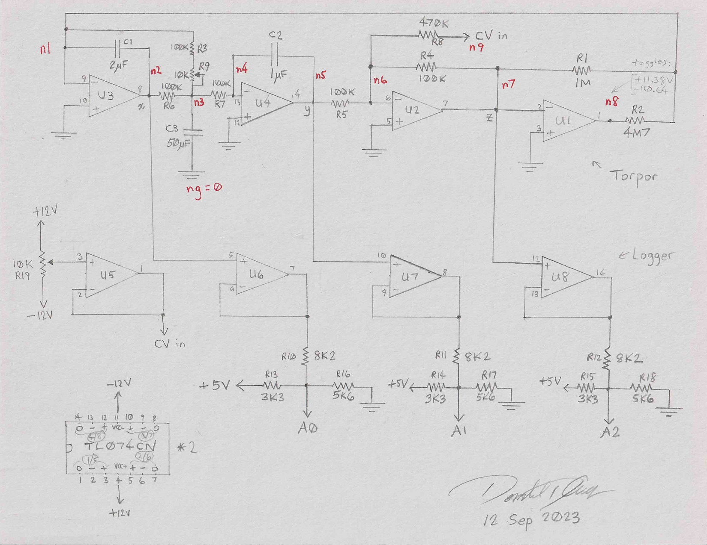

# Sloth Circuit Analysis

<!--

-->

## Setting up the equations

Write current equations for nodes in the circuit.

The node `n1` is assumed to be a *virtual ground* at 0V:

$$
\frac{z}{R_1} + \frac{Q(z)}{R_2} + \frac{w}{R_3+K} = -C_1 \frac{\mathrm{d}x}{\mathrm{d}t}
\tag{1}
$$

Where $w$ is the voltage at `n3`, $K$ is the variable value of the potentiometer $R_9$,
and $Q(z)$ is the alternating output of the comparator `U1`.
In my breadboard construction of the Sloth circuit, I measure $Q(z)$ toggling between
+11.38&nbsp;V and &minus;10.64&nbsp;V, based on the polarity of $z$.

The current equation for node `n3`:

$$
\frac{x-w}{R_6} =
    C_3 \frac{\mathrm{d}w}{\mathrm{d}t} +
    \frac{w}{R_3 + K} +
    \frac{w}{R_7}
\tag{2}
$$

The op-amp `U4` has the following current equation for its inverting input node:

$$
\frac{w}{R_7} = -C_2 \frac{\mathrm{d}y}{\mathrm{d}t}
\tag{3}
$$

And the final node equation describes the currents flowing through the inverting input of `U2`:

$$
\frac{y}{R_5} + \frac{U}{R_8} + \frac{z}{R_4} = 0
\tag{4}
$$

Where $U$ is the applied control voltage (CV).

## Isolating variables

Rewrite equations to isolate the node voltage variables $w$, $x$, $y$, and $z$.

We can start with equation (3) to write $w$ in terms of $y$:

$$
w = - R_7 C_2 \frac{\mathrm{d}y}{\mathrm{d}t}
\tag{5}
$$

Solve equation (2) for $x$:

$$
x = R_6 C_3 \frac{\mathrm{d}w}{\mathrm{d}t} +
\left( 1 + \frac{R_6}{R_3 + K} + \frac{R_6}{R_7} \right) w
\tag{6}
$$

Solve equation (4) for $z$:

$$
z = - R_4 \left( \frac{y}{R_5} + \frac{U}{R_8} \right)
\tag{7}
$$

## Software simulation

The capacitors $C_1$, $C_2$, and $C_3$ are like analog memories.
Their initial charge states are boundary values for the differential equations.
It is reasonable and practical to assume the circuit powers up with uncharged
capacitors, so we can assume the node voltages at $t=0$ are

$$
x_0=w_0=y_0=0
$$

The control voltage $U$ is sampled at each time step. On each iteration,
we can calculate $z$ from eqution (7).

Depending on the polarity of $U$, calculate the comparator output $Q(z)$ as +11.38&nbsp;V
if $U \ge 0$, or &minus;10.64&nbsp;V if $U \lt 0$.

Rewrite equation (1) to find the infinitesimal change in $x$:

$$
\mathrm{d} x = - \frac{\mathrm{d} t}{C_1}
    \left(
        \frac{z_n}{R_1} +
        \frac{Q(z_n)}{R_2} +
        \frac{w_n}{R_3 + K}
    \right)
\tag{8}
$$

We know the values of everything on the right hand side of equation (8),
so we can update the value of $x$ by approximating the infinitesimal
quantities as finite differences:

$$
x_{n+1} = x_n - \frac{\Delta t}{C_1}
    \left(
        \frac{z_n}{R_1} +
        \frac{Q(z_n)}{R_2} +
        \frac{w_n}{R_3 + \bar{K}}
    \right)
\tag{9}
$$

where $\bar{K}$ is the mean value of the potentiometer over the time step:

$$
\bar{K} = \frac{K_n + K_{n+1}}{2}
$$

Because the control voltage $U$ is also a function of time,
we express its mean value over the time interval as

$$
\bar{U} = \frac{U_n + U_{n+1}}{2}
$$

Continuing in the same fashion, we use equation (2) to find a finite difference
estimate for the change in $w$ over the current time step:

$$
w_{n+1} = w_n + \frac{\Delta t}{C_3}
    \left[
        \frac{1}{R_6} x_n -
        \left(
            \frac{1}{R_6} +
            \frac{1}{R_3 + \bar{K}} +
            \frac{1}{R_7}
        \right) w_n
    \right]
\tag{10}
$$

Use equation (3) to update the value of $y$:

$$
y_{n+1} = y_n - \frac{\Delta t}{R_7 C_2} w_n
\tag{11}
$$

Use equation (7) to update the value of $z$:

$$
z_{n+1} = - R_4
    \left (
        \frac{y_{n+1}}{R_5} +
        \frac{\bar{U}}{R_8}
    \right)
\tag{12}
$$

And finally, update the comparator output:

$$
Q(z_{n+1}) =
    \begin{cases}
        \mathrm{+11.38 V} & \text{when } z_{n+1} \lt 0 \\
        \mathrm{-10.64 V} & \text{when } z_{n+1} \ge 0 \\
    \end{cases}
\tag{13}
$$

Now we could keep iterating steps (9) through (13) for each successive
sample $n$ to generate the output signal. But this may be too simple for good accuracy.

## Refined stability and precision

Approximating infinitesimals like $\mathrm{d}x$ with finite differences
like $\Delta x$ is risky for accuracy and numerical stability.

Therefore, it is better to refine the algorithm above by using iteration
to converge on mean values $\bar{x}$ over the interval $x_n$ to $x_{n+1}$,
$\bar{w}$ over the interval $w_n$ to $w_{n+1}$, etc., wherever a capacitor
is being charged/discharged over the time interval.

The idea is to start with steps (9) through (12) as outlined above to
compute initial estimates of $x_{n+1}$, $w_{n+1}$, $y_{n+1}$, and $z_{n+1}$.

Then define mean values over the time interval as

$$
\bar{x} = \frac{x_n + x_{n+1}}{2}
$$

$$
\bar{w} = \frac{w_n + w_{n+1}}{2}
$$

$$
\bar{y} = \frac{y_n + y_{n+1}}{2}
$$

$$
\bar{z} = \frac{z_n + z_{n+1}}{2}
$$

The mean value $\bar{Q}$ requires care when $z_n$ and $z_{n+1}$ have
opposite polarities, or more precisely, when $z_n z_{n+1} \lt 0$.
In this case, use a weighted mean value of $\bar{Q}$ over the time
interval. Assuming that $z(t)$ is approximately linear over the time
step, let $0 \le \alpha \le 1$ represent the fraction of the time step
at which $z(t) = 0$. Then

$$
\alpha = \frac{z_n}{z_n - z_{n+1}}
$$

Then compute the weighted mean

$$
\bar{Q} = \alpha Q{z_n} + (1 - \alpha) Q(z_{n+1})
$$

Now we have updated estimates for the mean values of
all the voltage variables over the time interval.

Update our estimates of the voltages in the next
time step by using modified versions of steps (9) through (11):

$$
x_{n+1} = x_n - \frac{\Delta t}{C_1}
    \left(
        \frac{\bar{z}}{R_1} +
        \frac{\bar{Q}}{R_2} +
        \frac{\bar{w}}{R_3 + \bar{R_9}}
    \right)
\tag{14}
$$

$$
w_{n+1} = w_n + \frac{\Delta t}{C_3}
    \left[
        \frac{1}{R_6} \bar{x} -
        \left(
            \frac{1}{R_6} +
            \frac{1}{R_3 + \bar{R_9}} +
            \frac{1}{R_7}
        \right) \bar{w}
    \right]
\tag{15}
$$

$$
y_{n+1} = y_n - \frac{\Delta t}{R_7 C_2} \bar{w}
\tag{16}
$$

Fortunately, we can assume the op-amp `U2` responds instanteously
to its input, since there is no capacitor to be charged or discharged,
so equation (12) remains unchanged:

$$
z_{n+1} = - R_4
    \left (
        \frac{y_{n+1}}{R_5} +
        \frac{U}{R_8}
    \right)
$$

Iterate these steps until the values $x_{n+1}$, $w_{n+1}$, $y_{n+1}$, and $z_{n+1}$
converge within tolerance. This should probably happen after two or three iterations
at the most.

